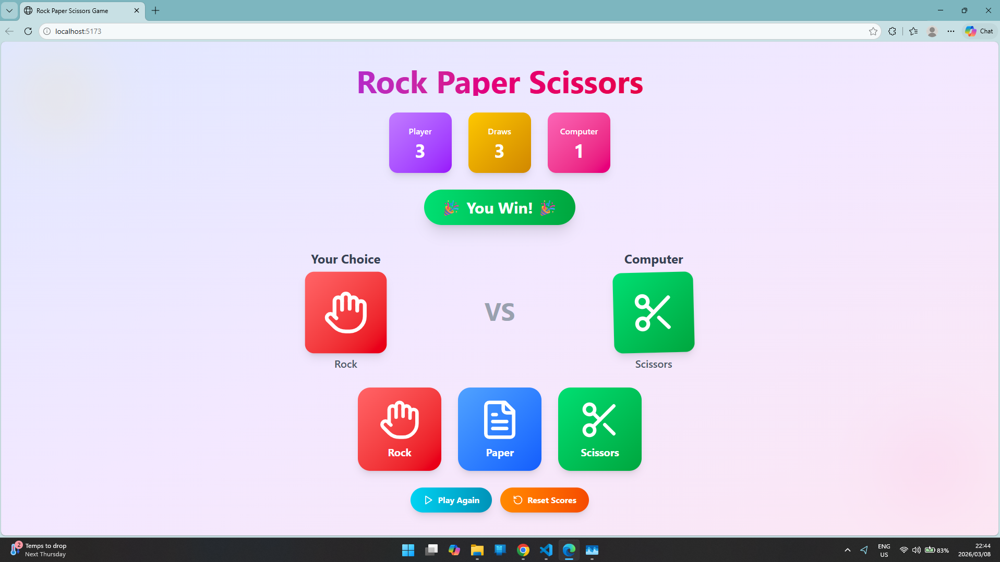

  # 🎮 Rock Paper Scissors Game

## 📌 Project Overview

This project is a **Rock Paper Scissors web game** developed as part of a **Software Engineering assignment** for the *Postgraduate Diploma in Software Engineering*.

The application allows a user to play Rock Paper Scissors against the computer. The computer randomly selects a move and the system determines the winner according to the traditional rules of the game.

The project demonstrates the use of:

* Modern **JavaScript**
* **HTML and CSS UI design**
* **Animations and interactive UI**
* **Version control using GitHub**

---

# 🕹️ Features

* 🎨 **Simple and colorful user interface**
* 🖱️ **Clickable buttons for Rock, Paper, and Scissors**
* 🤖 **Random computer move generation**
* 🏆 **Automatic winner detection**
* 📊 **Scoreboard tracking**

  * Player score
  * Computer score
  * Draws
* 🔁 **Play Again functionality**
* ♻️ **Reset scores button**
* ✨ **UI animations for a fun gameplay experience**

---

# 🧠 Game Rules

The rules of Rock Paper Scissors are:

| Player Choice | Computer Choice | Result        |
| ------------- | --------------- | ------------- |
| Rock          | Scissors        | Player Wins   |
| Rock          | Paper           | Computer Wins |
| Paper         | Rock            | Player Wins   |
| Paper         | Scissors        | Computer Wins |
| Scissors      | Paper           | Player Wins   |
| Scissors      | Rock            | Computer Wins |
| Same Choice   | Same Choice     | Draw          |

---

# 🛠️ Technologies Used

* **HTML5**
* **CSS3**
* **JavaScript (ES6)**
* **Node.js**
* **Vite (Development Server)**

---

# 📂 Project Structure

```
rock-paper-scissors
│
├── node_modules/          # Project dependencies (ignored by Git)
├── screenshots/           # Screenshots of the application running
│   └── image.png
│
├── src/                   # Source code for the React application
│   ├── app/
│   │   ├── components/    # Reusable UI components
│   │   └── App.tsx        # Main application logic
│   │
│   ├── styles/            # Application styling
│   │
│   └── main.tsx           # Application entry point
│
├── index.html             # Main HTML file
├── package.json           # Project dependencies and scripts
├── package-lock.json      # Dependency lock file
├── postcss.config.js      # PostCSS configuration
├── vite.config.ts         # Vite configuration
├── ATTRIBUTIONS.md        # Asset and icon attributions
├── README.md              # Project documentation
└── .gitignore             # Files excluded from Git tracking
```

---

# ⚙️ Installation & Setup

### 1️⃣ Install Node.js

Download and install Node.js from:

https://nodejs.org

Verify installation:

```
node -v
npm -v
```

---

### 2️⃣ Clone the Repository

```
git clone https://github.com/219181527/rock-paper-scissors.git
```

Navigate into the project folder:

```
cd rock-paper-scissors
```

---

### 3️⃣ Install Dependencies

```
npm install
```

---

### ⚠️ PowerShell Execution Policy Fix

When running `npm install`, the following error may occur in Windows PowerShell:

```
npm.ps1 cannot be loaded because running scripts is disabled on this system
```

To resolve this issue, run the following command in PowerShell:

```
Set-ExecutionPolicy RemoteSigned -Scope CurrentUser
```

Then confirm with:

```
Y
```

After this, run the installation again:

```
npm install
```

---

### 4️⃣ Start the Development Server

Run the following command:

```
npm run dev
```

The application will start on a local server such as:

```
http://localhost:5173
```

Open the URL in your browser to play the game.

---

# 📸 Screenshot

Example of the application running locally:




---

# 🚀 Future Improvements

Possible improvements for the project:

* Add sound effects
* Add player name input
* Add game history tracking
* Add multiplayer mode
* Improve mobile responsiveness

---

# 📚 Learning Outcomes

Through this project the following skills were practiced:

* Version control using **Git and GitHub**
* Creating and managing commits
* Writing clear **project documentation**
* Building a **simple interactive web application**
* Managing dependencies using **Node.js**

---

# 👨‍💻 Author

**Mongameli Shasha**

Postgraduate Diploma in Software Engineering
Software Engineering Project Assignment

---

# 📄 License

This project was created for **educational purposes**.
